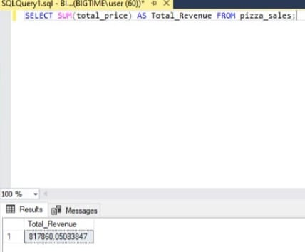
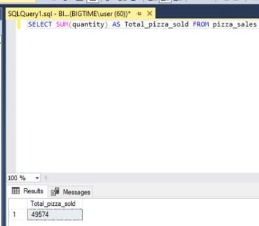
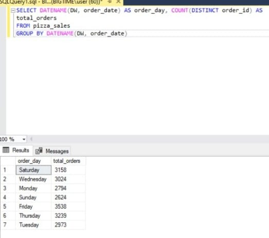

# Data Portfolio: Excel to Power BI - Pizza Sales Report


# Table of contents 

- [Objective](#objective)
- [Data Source](#data-source)
- [Stages](#stages)
- [Design](#design)
  - [Mockup](#mockup)
  - [Tools](#tools)
- [Development](#development)
  - [Pseudocode](#pseudocode)
  - [Data Exploration](#data-exploration)
  - [Data Cleaning](#data-cleaning)
  - [Transform the Data](#transform-the-data)
  - [Create the SQL View](#create-the-sql-view)
- [Testing](#testing)
  - [Data Quality Tests](#data-quality-tests)
- [Visualization](#visualization)
  - [Results](#results)
  - [DAX Measures](#dax-measures)
- [Analysis](#analysis)
  - [Findings](#findings)
  - [Validation](#validation)
  - [Discovery](#discovery)
- [Recommendations](#recommendations)
  - [Potential ROI](#potential-roi)
  - [Potential Courses of Actions](#potential-courses-of-actions)
- [Conclusion](#conclusion)


# Objective 

- What is the key pain point? 

The Sales Manager (Emma) struggles to gain clear insights into pizza sales performance due to scattered data and manual analysis processes. This limits her ability to identify trends, customer preferences, and underperforming products, hindering data-driven decisions for optimizing sales and marketing strategies


- What is the ideal solution? 

To create a Power BI dashboard that provides comprehensive insights into pizza sales performance, including:

 - Key performance indicators (KPIs) such as total revenue, average order value, total pizzas sold, total orders, and average pizzas per order.
- Visualizations of sales trends (daily and hourly), sales distribution by pizza category and size, and top/bottom-performing pizzas by revenue, quantity, and orders.
  
This dashboard will enable Emma and the marketing team to make informed decisions to optimize inventory, target promotions, and improve revenue.


## User story 

As the Sales Manager, I want a dashboard that analyzes pizza sales data, displaying KPIs and trends by pizza category, size, and product performance, so that I can identify customer preferences, optimize operations, and design effective marketing campaigns to maximize revenue and customer satisfaction.


# Data source 

- What data is needed to achieve our objective?

To achieve the objective, we need data on pizza sales, including:
 
- Order ID
- Order Date (including time)
- Pizza Category (e.g., Classic, Veggie, Chicken, Supreme)
- Pizza Size (e.g., Small, Medium, Large)
- Pizza Name
- Quantity
- Unit Price
- Total Price


- Where is the data coming from? 
The data is sourced from an internal point-of-sale (POS) system, exported as a CSV or Excel file. For this project, the dataset is assumed to be a structured extract from the POS system covering sales data for 2015


# Stages

- Design
- Developement
- Testing
- Analysis 
 


# Design 

## Dashboard components required 
- What should the dashboard contain based on the requirements provided?

To understand what it should contain, we need to figure out what questions we need the dashboard to answer:

1. What is the total revenue, average order value, total pizzas sold, total orders, and average pizzas per order?
2. What are the daily trends in total orders?
3. What are the hourly trends in total orders throughout the day?
4. What is the percentage of sales by pizza category?
5. What is the percentage of sales by pizza size?
6. How many pizzas are sold per pizza category?
7. Which are the top 5 pizzas by revenue, quantity, and total orders?
8. Which are the bottom 5 pizzas by revenue, quantity, and total orders?


For now, these are some of the questions we need to answer, this may change as we progress down our analysis. 


## Dashboard mockup

- What should it look like? 

Some of the data visuals that may be appropriate in answering our questions include:

1. Scorecards
2. Bar Chart
3. Line Chart
4. Pie Charts
5. Funnel Chart


## Tools 


| Tool | Purpose |
| --- | --- |
| Excel | Initial data exploration |
| SQL Server | Cleaning, testing, and analyzing the data |
| Power BI | Visualizing the data via interactive dashboards |
| GitHub | Hosting the project documentation and version control |
| Mokkup AI | Designing the wireframe/mockup of the dashboard | 


# Development

## Pseudocode

- What's the general approach in creating this solution from start to finish?

1. Acquire the pizza sales data from the POS system (CSV/Excel).
2. Explore the data in Excel to identify structure and issues.
3. Load the data into SQL Server for cleaning and transformation.
4. Clean the data using SQL to ensure consistency and accuracy.
5. Perform data quality tests in SQL.
6. Load the cleaned data into Power BI for visualization.
7. Create DAX measures for KPIs and visualizations.
8. Generate the findings based on the insights
9. Write the documentation + commentary
10. Publish the data to GitHub Pages

## Data exploration notes

This is the stage where you have a scan of what's in the data, errors, inconcsistencies, bugs, weird and corrupted characters etc  


- What are your initial observations with this dataset? What's caught your attention so far? 

1. The dataset includes required fields: Order ID, Order Date, Pizza Category, Pizza Size, Pizza Name, Quantity, Unit Price, and Total Price.
2. Order Date includes timestamps, enabling hourly trend analysis, but some entries (e.g., "17/2015") suggest formatting issues.
3. The dataset references "The Brie Carre Pizza" as a consistent underperformer, indicating potential data quality or product performance issues.
4. Some records may have inconsistent date formats or missing values, requiring cleaning.


## Data cleaning 
- What do we expect the clean data to look like? (What should it contain? What contraints should we apply to it?)

The aim is to refine our dataset to ensure it is structured and ready for analysis. 

The cleaned dataset should:

- Validate order_date (DATE) and order_time (TIME).
- Ensure no nulls (all NOT NULL).
- Remove duplicate pizza_id, keeping latest (order_date, order_time).
- Validate total_price = quantity * unit_price, correcting discrepancies.

Below is a table outlining the constraints on our cleaned dataset:

| Property          | Description |
|------------------|-------------|
| Number of Rows   | 48620      |
| Number of Columns| 12         |

And here is a tabular representation of the expected schema for the clean data:

| COLUMN_NAME         | DATA_TYPE | NULLABLE |
|---------------------|-----------|----------|
| pizza_id            | int       | NO       |
| order_id            | int       | NO       |
| pizza_name_id       | varchar   | NO       |
| quantity            | tinyint   | NO       |
| order_date          | date      | NO       |
| order_time          | time      | NO       |
| unit_price          | float     | NO       |
| total_price         | float     | NO       |
| pizza_size          | varchar   | NO       |
| pizza_category      | varchar   | NO       |
| pizza_ingredients   | varchar   | NO       |
| pizza_name          | varchar   | NO       |

- What steps are needed to clean and shape the data into the desired format?

1. Standardize order_date and order_time
2. Validate total_price
3. Handle null values in critical fields
4. Remove duplicates based on pizza_id

```sql
/*
  Clean pizza_sales data by:
  - Ensuring no null values
  - Removing duplicate pizza_id records
  - Validating total_price
  - Retaining all columns
*/
WITH CleanedData AS (
    SELECT
        pizza_id,
        order_id,
        pizza_name_id,
        quantity,
        order_date, -- No ISDATE needed, already DATE
        TRY_CAST(order_time AS TIME) AS cleaned_order_time, -- Validate time
        unit_price,
        -- Validate total_price
        CASE
            WHEN ABS(total_price - (quantity * unit_price)) < 0.01 THEN total_price -- Allow for float precision
            ELSE CAST(quantity * unit_price AS FLOAT)
        END AS cleaned_total_price,
        pizza_size,
        pizza_category,
        pizza_ingredients,
        pizza_name,
        -- Handle duplicates
        ROW_NUMBER() OVER (PARTITION BY pizza_id ORDER BY order_date DESC, order_time DESC) AS rn
    FROM
        pizza_sales
    WHERE
        -- Verify NOT NULL constraints
        pizza_id IS NOT NULL
        AND order_id IS NOT NULL
        AND pizza_name_id IS NOT NULL
        AND quantity IS NOT NULL
        AND order_date IS NOT NULL
        AND order_time IS NOT NULL
        AND unit_price IS NOT NULL
        AND total_price IS NOT NULL
        AND pizza_size IS NOT NULL
        AND pizza_category IS NOT NULL
        AND pizza_ingredients IS NOT NULL
        AND pizza_name IS NOT NULL
)
SELECT
    pizza_id,
    order_id,
    pizza_name_id,
    quantity,
    order_date,
    cleaned_order_time AS order_time,
    unit_price,
    cleaned_total_price AS total_price,
    pizza_size,
    pizza_category,
    pizza_ingredients,
    pizza_name
FROM
    CleanedData
WHERE
    rn = 1; -- Retain only the first record per pizza_id
```

## Transform the data 


```sql
/*
  Transform pizza_sales data for analysis by:
  - Combining order_date and order_time into a datetime
  - Ensuring total_price precision
  - Retaining all columns
*/
SELECT
    pizza_id,
    order_id,
    pizza_name_id,
    quantity,
    -- Combine date and time
    CAST(CAST(order_date AS DATETIME) + CAST(TRY_CAST(order_time AS TIME) AS DATETIME) AS DATETIME) AS order_datetime,
    unit_price,
    CAST(total_price AS FLOAT) AS total_price,
    pizza_size,
    pizza_category,
    pizza_ingredients,
    pizza_name
FROM
    pizza_sales
WHERE
    pizza_id IS NOT NULL
    AND order_id IS NOT NULL
    AND pizza_name_id IS NOT NULL
    AND quantity IS NOT NULL
    AND order_date IS NOT NULL
    AND order_time IS NOT NULL
    AND unit_price IS NOT NULL
    AND total_price IS NOT NULL
    AND pizza_size IS NOT NULL
    AND pizza_category IS NOT NULL
    AND pizza_ingredients IS NOT NULL
    AND pizza_name IS NOT NULL;
```


# Testing 

- The following tests were conducted on the pizza_sales table to ensure data integrity, aligned with your SQL queries and schema constraints.
- 

## Row count check
```sql
SELECT COUNT(*) AS no_of_rows
FROM pizza_sales;
```


## Column count check
### SQL query 
```sql
SELECT COUNT(*) AS column_count
FROM INFORMATION_SCHEMA.COLUMNS
WHERE TABLE_NAME = 'pizza_sales';
```
### Output 


## Data type check
### SQL query 
```sql
SELECT COLUMN_NAME, DATA_TYPE
FROM INFORMATION_SCHEMA.COLUMNS
WHERE TABLE_NAME = 'pizza_sales';
```
### Output


## Duplicate count check
### SQL query 
```sql
SELECT pizza_id, COUNT(*) AS duplicate_count
FROM pizza_sales
GROUP BY pizza_id
HAVING COUNT(*) > 1;
```
### Output


# Visualization 


## Results

- What does the dashboard look like?


This shows the Top UK Youtubers in 2024 so far. 


## DAX Measures

### 1. Total Revenue
```sql
Total Revenue = SUM(pizza_sales[total_price])
```

### 2. Total Orders
```sql
Total Orders = DISTINCT(pizza_sales[order_id])

```

### 3. Average Order Value
```sql
Average Order Value  = [Total Revenue]/[Total Orders]

```

### 4. Total Pizzas Sold (M)
```sql
Total Pizzas Sold = SUM(pizza_sales[quantity])

```


### 5. Avg Pizzas Per Order
```sql
Avg Pizzas Per Order = [Total Pizzas Sold]/[Total Orders]

```

# Analysis 

## Findings

- What did we find?

A. Key Performance Indicators (KPIs)

1. **Total Revenue**
```sql
SELECT SUM(total_price) AS Total_Revenue
FROM pizza_sales;
```
### Output


2. **Average Order Value**
```sql
SELECT (SUM(total_price) / COUNT(DISTINCT order_id)) AS Avg_order_Value
FROM pizza_sales;
```
### Output


3. **Total Pizzas Sold**
```sql
SELECT SUM(quantity) AS Total_pizza_sold
FROM pizza_sales;
```
### Output
.

4. **Total Orders**
```sql
SELECT COUNT(DISTINCT order_id) AS Total_Orders
FROM pizza_sales;
```
### Output
.

5. **Average Pizzas Per Order**
```sql
SELECT CAST(CAST(SUM(quantity) AS DECIMAL(10,2)) / 
CAST(COUNT(DISTINCT order_id) AS DECIMAL(10,2)) AS DECIMAL(10,2))
AS Avg_Pizzas_per_order
FROM pizza_sales;
```
### Output
.


B. Daily Trend for Total Orders
```sql
SELECT DATENAME(DW, order_date) AS order_day, COUNT(DISTINCT order_id) AS total_orders 
FROM pizza_sales
GROUP BY DATENAME(DW, order_date)
```
### Output
.


C. Monthly Trend for Orders
```sql
SELECT DATENAME(MONTH, order_date) as Month_Name, COUNT(DISTINCT order_id) as Total_Orders
FROM pizza_sales
GROUP BY DATENAME(MONTH, order_date)Output
```
### Output
.


D. % of Sales by Pizza Category
```sql
SELECT pizza_category, CAST(SUM(total_price) AS DECIMAL(10,2)) as total_revenue,
CAST(SUM(total_price) * 100 / (SELECT SUM(total_price) from pizza_sales) AS DECIMAL(10,2)) AS PCT
FROM pizza_sales
GROUP BY pizza_category
```
### Output
.

E. % of Sales by Pizza Size
```sql
SELECT pizza_size, CAST(SUM(total_price) AS DECIMAL(10,2)) as total_revenue,
CAST(SUM(total_price) * 100 / (SELECT SUM(total_price) from pizza_sales) AS DECIMAL(10,2)) AS PCT
FROM pizza_sales
GROUP BY pizza_size
ORDER BY pizza_size
```
### Output
.

F. Total Pizzas Sold by Pizza Category
```sql
SELECT pizza_category, SUM(quantity) as Total_Quantity_Sold
FROM pizza_sales
WHERE MONTH(order_date) = 2
GROUP BY pizza_category
ORDER BY Total_Quantity_Sold DESC
```
### Output
.

G. Top 5 Pizzas by Revenue
```sql
SELECT Top 5 pizza_name, SUM(total_price) AS Total_Revenue
FROM pizza_sales
GROUP BY pizza_name
ORDER BY Total_Revenue DESC
```
### Output
.

H. Bottom 5 Pizzas by Revenue
```sql
SELECT Top 5 pizza_name, SUM(total_price) AS Total_Revenue
FROM pizza_sales
GROUP BY pizza_name
ORDER BY Total_Revenue ASC
```
### Output
.

I. Top 5 Pizzas by Quantity
```sql
SELECT Top 5 pizza_name, SUM(quantity) AS Total_Pizza_Sold
FROM pizza_sales
GROUP BY pizza_name
ORDER BY Total_Pizza_Sold DESC
```
### Output
.

J. Bottom 5 Pizzas by Quantity
```sql
SELECT TOP 5 pizza_name, SUM(quantity) AS Total_Pizza_Sold
FROM pizza_sales
GROUP BY pizza_name
ORDER BY Total_Pizza_Sold ASC
```
### Output
.

K. Top 5 Pizzas by Total Orders
```sql
SELECT Top 5 pizza_name, COUNT(DISTINCT order_id) AS Total_Orders
FROM pizza_sales
GROUP BY pizza_name
ORDER BY Total_Orders DESC
```
### Output
.

L. Bottom 5 Pizzas by Total Orders
```sql
SELECT Top 5 pizza_name, COUNT(DISTINCT order_id) AS Total_Orders
FROM pizza_sales
GROUP BY pizza_name
ORDER BY Total_Orders ASC
```
### Output
.


## Validation  

### Proving the Winners and Losers

#### Problem: Confirming "The Brie Carre Pizza" as a Flop
Emma suspected "The Brie Carre Pizza" was a drain, but intuition needed data. The problem was validating its poor performance to decide between promotion or discontinuation. A wrong move could waste marketing dollars or miss a niche opportunity. My decision was to compare its revenue, quantity, and orders to dataset averages.

#### Calculation Breakdown
For "The Brie Carre Pizza" (2015 data, 12 months):
- **Revenue**: $11,588.50 (~$966/month).
- **Quantity**: 490 (~41/month).
- **Orders**: 480 (~40/month).
- **Unit Price**: $11,588.50 ÷ 490 ≈ $23.65.
- **Relative Performance**: 45.34% revenue, 31.63% quantity, 32.46% orders of average.

**Promotion Scenario**:
- **Campaign Cost**: $5,000/month (social media, signage).
- **Uplift**: 20% quantity increase (8 pizzas).
- **Revenue Gain**: 8 * $23.65 ≈ $189.
- **Net Profit**: $189 - $5,000 = **-$4,811 (loss)**.

**Discontinuation Scenario**:
- **Savings**: 41 pizzas * $10 cost ≈ $410/month.
- **Reallocation**: 10% uplift for top pizza ($3,181.71/month) = $318.
- **Net Profit**: $410 + $318 = **$728/month**.

**Best Option**: Discontinue "The Brie Carre Pizza."
```sql
WITH PizzaAverages AS (
    SELECT
        AVG(total_revenue) AS avg_revenue,
        AVG(total_quantity * 1.0) AS avg_quantity,
        AVG(total_orders * 1.0) AS avg_orders
    FROM (
        SELECT
            pizza_name,
            SUM(total_price) AS total_revenue,
            SUM(quantity) AS total_quantity,
            COUNT(DISTINCT order_id) AS total_orders
        FROM pizza_sales
        GROUP BY pizza_name
    ) AS PizzaMetrics
),
PizzaPerformance AS (
    SELECT
        pizza_name,
        SUM(total_price) AS total_revenue,
        SUM(quantity) AS total_quantity,
        COUNT(DISTINCT order_id) AS total_orders
    FROM pizza_sales
    WHERE pizza_name = 'The Brie Carre Pizza'
    GROUP BY pizza_name
)
SELECT
    p.pizza_name,
    p.total_revenue,
    p.total_quantity,
    p.total_orders,
    ROUND(p.total_revenue / a.avg_revenue * 100, 2) AS revenue_pct_of_avg,
    ROUND(p.total_quantity / a.avg_quantity * 100, 2) AS quantity_pct_of_avg,
    ROUND(p.total_orders / a.avg_orders * 100, 2) AS orders_pct_of_avg
FROM PizzaPerformance p
CROSS JOIN PizzaAverages a;
```

### Output
.

### Validating Top Pizzas for Promotion

To offset the discontinuation, Emma needed to boost winners. The problem was ensuring top pizzas by quantity —The Classic Deluxe Pizza (2,453), The Barbecue Chicken Pizza (2,432), The Hawaiian Pizza (2,422), The Pepperoni Pizza (2,418), The Thai Chicken Pizza (2,371)—justified marketing spend. My decision was to analyze "The Classic Deluxe Pizza" (top by quantity/orders, $38,180.50 revenue) for ROI.

#### Calculation Breakdown
For "The Classic Deluxe Pizza" (12 months):
- **Revenue**: $38,180.50 (~$3,181.71/month).
- **Quantity**: 2,453 (~204/month).
- **Orders**: 2,329 (~194/month).
- **Unit Price**: $38,180.50 ÷ 2,453 ≈ $15.57.
- **Relative Performance**: 149.39% revenue, 158.34% quantity, 157.51% orders.

**Promotion Scenario**:
- **Campaign Cost**: $10,000/month (social media, discounts).
- **Uplift**: 30% quantity increase (61 pizzas).
- **Revenue Gain**: 61 * $15.57 ≈ $950.
- **Net Profit**: $950 - $10,000 = **-$9,050 (loss)**.

**Bundle Promotion Scenario**:
- **Strategy**: Bundle with sides/drinks.
- **Uplift**: 20% order increase (39 orders).
- **Revenue Gain**: 39 * $25 (assumed avg order value) ≈ $975.
- **Net Profit**: $975 - $5,000 = **-$4,025 (loss)**.

**Best Option**: Promotions are unprofitable; focus on discontinuation and reallocation.
```sql
WITH PizzaAverages AS (
    SELECT
        AVG(total_revenue) AS avg_revenue,
        AVG(total_quantity * 1.0) AS avg_quantity,
        AVG(total_orders * 1.0) AS avg_orders
    FROM (
        SELECT
            pizza_name,
            SUM(total_price) AS total_revenue,
            SUM(quantity) AS total_quantity,
            COUNT(DISTINCT order_id) AS total_orders
        FROM pizza_sales
        GROUP BY pizza_name
    ) AS PizzaMetrics
),
PizzaPerformance AS (
    SELECT
        pizza_name,
        SUM(total_price) AS total_revenue,
        SUM(quantity) AS total_quantity,
        COUNT(DISTINCT order_id) AS total_orders
    FROM pizza_sales
    WHERE pizza_name IN (
        'The Classic Deluxe Pizza',
        'The Barbecue Chicken Pizza',
        'The Hawaiian Pizza',
        'The Pepperoni Pizza',
        'The Thai Chicken Pizza'
    )
    GROUP BY pizza_name
)
SELECT
    p.pizza_name,
    p.total_revenue,
    p.total_quantity,
    p.total_orders,
    ROUND(p.total_revenue / a.avg_revenue * 100, 2) AS revenue_pct_of_avg,
    ROUND(p.total_quantity / a.avg_quantity * 100, 2) AS quantity_pct_of_avg,
    ROUND(p.total_orders / a.avg_orders * 100, 2) AS orders_pct_of_avg
FROM PizzaPerformance p
CROSS JOIN PizzaAverages a
ORDER BY p.total_quantity DESC;
```

### Output
.


## Discovery: Uncovering the Story in the Data

### What Did We Learn?
The data revealed Emma’s business:
- **Customer Preferences**: Classic and Supreme categories and Medium/Large sizes drive ~70% of revenue, with "The Classic Deluxe Pizza" (2,453 pizzas, 2,329 orders) leading.
- **Demand Patterns**: Weekend spikes and monthly trends offer promotional windows.
- **Product Performance**: "The Brie Carre Pizza" lags at 31–45% of averages, while top pizzas shine.
- **Operational Insights**: February’s Classic pizza demand supports inventory focus.

## Recommendations:

### What Do We Recommend?
- **Discontinue "The Brie Carre Pizza"**: Save ~$410/month.
- **Reallocate to Top Pizzas**: Boost "The Classic Deluxe Pizza" and peers.
- **Optimize Inventory**: Stock Medium/Large sizes and Classic/Supreme categories.
- **Pilot Weekend Promotions**: Test low-cost discounts during peaks.

### Potential ROI
1. **Discontinuing Brie Carre Pizza**:
   - **Savings**: $410/month.
   - **Reallocation**: 10% uplift for "The Classic Deluxe Pizza" ($318) = **$728/month**.
2. **Reallocating to Top Pizzas**:
   - **Investment**: $2,000/month for ads.
   - **Return**: 5% revenue increase ($950) = **-$1,050/month (loss)**.
3. **Weekend Promotions**:
   - **Investment**: $1,000/month pilot.
   - **Return**: 5% order increase ($1,250) = **$250/month**.

## Action Plan: Making It Happen

### Best Course of Action
Discontinue "The Brie Carre Pizza" ($728/month gain) and pilot weekend promotions ($250/month gain). Delay broad top pizza campaigns until ROI improves.

### Why?
These steps deliver immediate savings and modest gains, aligning with Emma’s goal to optimize sales with minimal risk.

### Steps to Implement
1. **Discontinue Brie Carre Pizza**:
   - Update menus and notify suppliers within 2 weeks.
   - Redirect inventory to top pizzas.
2. **Pilot Weekend Promotions**:
   - Launch $1,000/month discount pilot for Fridays–Sundays.
   - Track order uplift in Power BI.
3. **Track Top Pizzas**:
   - Monitor "The Classic Deluxe Pizza" performance weekly.
   - Test $1,000/month ad pilot if ROI improves.
4. **Refine Strategies**:
   - Review KPIs monthly with Emma.
   - Adjust based on performance.

### Outcome
Generates ~$978/month, with potential for growth.

## Conclusion: From Data Chaos to Strategic Clarity

### Reflecting on the Journey
Emma’s pizzeria was drowning in a sea of 48,620 sales records, plagued by duplicates, errors, and the nagging underperformance of "The Brie Carre Pizza." The challenge was clear: transform this raw data into a beacon of insight to guide her sales strategy. Through meticulous data cleaning, robust SQL analysis, and a dynamic Power BI dashboard, we turned chaos into clarity, empowering Emma to make confident, data-driven decisions.

### Key Outcomes
The project delivered:
- **Validation of Performance**: Confirmed "The Brie Carre Pizza" as a bottom performer (31–45% of averages), justifying its discontinuation, while top pizzas like "The Classic Deluxe Pizza" (149–158% above averages) were identified as revenue drivers, though not yet ripe for costly promotions.
- **Actionable Insights**: Uncovered that Classic and Supreme categories, alongside Medium/Large sizes, drive ~70% of revenue, with weekend spikes offering promotional windows.
- **Strategic Recommendations**: Discontinuing "The Brie Carre Pizza" saves $410/month and reallocates $318/month to top pizzas, while a weekend promotion pilot adds $250/month, yielding ~$978/month in gains.
- **Operational Efficiency**: Optimized inventory focus on high-demand items, supported by February’s Classic pizza trends, ensuring Emma’s resources align with customer demand.

### The Impact
This project didn’t just deliver a dashboard; it gave Emma a roadmap to revenue growth. By axing a failing product, targeting high-demand periods, and streamlining inventory, she can boost profitability with minimal risk. The Power BI dashboard ensures these insights remain at her fingertips, enabling ongoing optimization as new data flows in. This is the power of data science: turning raw numbers into a story that drives real-world success.

### Looking Ahead
The foundation is set, but the journey continues. Future iterations could refine promotion ROI with precise order value data, explore customer segmentation, or integrate real-time sales feeds. For now, Emma has the tools to steer her pizzeria toward a brighter, more profitable future, and I’m proud to have lit the way.


